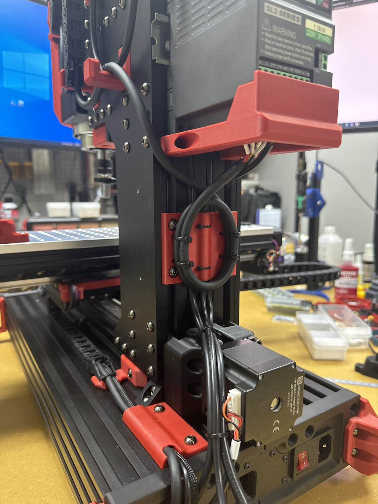

Note: When tilting back make sure the table is centered along X.  Too far to the side and it won't be stable when tilted back.  It's still a small footprint, be cautious when tilted.

VFD Bumper is shaped for the 220V VFD included in the EU LDO Kits.

Z_Column_Wire_Mgmt.stl uses M5x8 for mounting, everything else uses M5x10 for new hardware.

